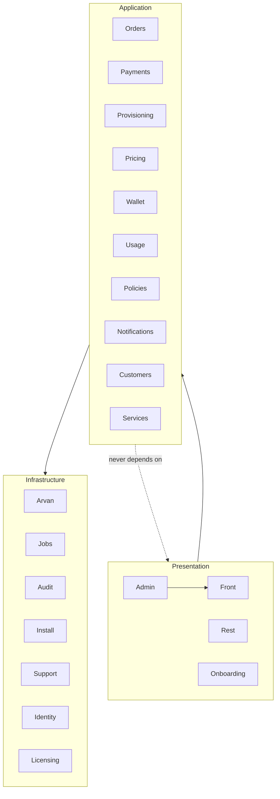

# Architecture

A modular monolith inside a standalone WordPress plugin (ADR-0001). This page is the map; the C4-style views live in [`docs/architecture/`](docs/architecture/), decisions in [`docs/adr/`](docs/adr/), data in [`docs/DATA_MODEL.md`](docs/DATA_MODEL.md).

## The one-paragraph version

WordPress supplies identity, HTTP, admin chrome and scheduling. Everything the business depends on — pricing, order state, payment claiming, provisioning, the money ledger, usage accounting, credit policy — lives in namespaced modules under `src/`, with the pure parts (state machine, pricing math, policy staging, balance derivation) free of WordPress entirely so they unit-test in milliseconds. Exactly two runtime boundaries vary and therefore get interfaces: the cloud provider (`Arvan\ProviderInterface`: real vs demo) and the payment gateway (`Payments\PaymentProviderInterface`: sandbox vs future PSPs). Correctness under concurrency is delegated to the database: unique business keys + `INSERT IGNORE` + single-row optimistic claims.

## Module dependency rules

Allowed direction: **Presentation → Application → Infrastructure**. Application modules may use each other laterally (Payments→Wallet, Usage→Policies) but never reach up into templates/REST. Pure classes (`Orders\StateMachine`, `Pricing\PricingEngine`, `Policies\PolicyEngine`, `Wallet\Ledger::derive`) import nothing from WordPress — enforced by the unit suite running without WordPress loaded.

## Module ownership map

| Module | Owns | May depend on |
|---|---|---|
| `Licensing` | PAT verification, activation state | Support |
| `Arvan` | HTTP client, providers, credentials, catalog cache, DTOs | Pricing (base costs), Support, Audit |
| `Pricing` | quote math, base-cost table, settings facade | Customers (rules), Support |
| `Orders` | state machine, order rows, events, claims | Pricing, Arvan (catalog), Customers, Support |
| `Payments` | gateway interface, sandbox, callback pipeline, top-ups | Orders, Wallet, Provisioning, Jobs, Notifications |
| `Provisioning` | idempotent create pipeline | Arvan, Orders, Services, Notifications, Audit |
| `Wallet` | append-only ledger, balance derivation, reconciliation | Support |
| `Usage` | sync, ingestion, policy application | Arvan, Services, Wallet, Policies, Notifications |
| `Policies` | pure staging + action matrix | — (pure) |
| `Jobs` | durable queue + runner | Provisioning, Usage (dispatch targets), Notifications |
| `Identity`/`Customers` | role, registration, per-customer rules | Support, Audit |
| `Admin`/`Front`/`Rest`/`Onboarding` | presentation + input validation | everything below |
| `Install` | schema migrations, page factory | Support |
| `Support`/`Audit` | crypto, options whitelist, helpers, audit log | — |

No circular dependencies; the one deliberate lateral cluster is the payment pipeline (Payments→{Orders, Wallet, Provisioning, Jobs}) because a verified payment IS the event that touches all four.

## Where the invariants live

| Invariant | Enforced at |
|---|---|
| Legal order transitions only | `StateMachine::can` + `OrderService::transition` (optimistic UPDATE) |
| One payment per ref, amount-bound | `orders.payment_ref UNIQUE` + `claim_paid` single UPDATE |
| One ledger entry per business event | `ledger UNIQUE(ref_type, ref_id, type)` + `rows_affected` |
| One service per order | `services.order_id UNIQUE` + pre-check + state claim |
| One charge per usage period | `usage UNIQUE(service, period)` → 1:1 ledger ref |
| Customer sees only own rows | session-derived IDs, `get_owned`, SQL scoping |
| Secrets stay secret | `Crypto` (sodium), UI masking, REST omission, log redaction |

## Extension points

- **New payment gateway**: implement `PaymentProviderInterface`, register via the `arvrs_payment_provider` filter — walkthrough in [`docs/extending-payment-provider.md`](docs/extending-payment-provider.md).
- **New cloud product**: add to `Catalog::PRODUCTS`, provider `plans()/options()/create()` branches, config whitelist in `OrderService::sanitize_config`, storefront template branch.
- **Real usage API**: single integration point `RealProvider::usage()`.
- **Remote licensing**: internals of `Licensing\License` (ADR-0009).
