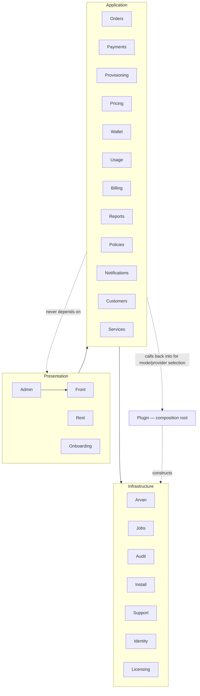

# Architecture

A modular monolith inside a standalone WordPress plugin (ADR-0001). This page is the map; the C4-style views live in [`docs/architecture/`](docs/architecture/), decisions in [`docs/adr/`](docs/adr/), data in [`docs/DATA_MODEL.md`](docs/DATA_MODEL.md).

## The one-paragraph version

WordPress supplies identity, HTTP, admin chrome and scheduling. Everything the business depends on — pricing, order state, payment claiming, provisioning, the money ledger, usage accounting, credit policy — lives in namespaced modules under `src/`, with the pure parts (state machine, pricing math, policy staging, balance derivation) free of WordPress entirely so they unit-test in milliseconds. Exactly two runtime boundaries vary and therefore get interfaces: the cloud provider (`Arvan\ProviderInterface`: real vs demo) and the payment gateway (`Payments\PaymentProviderInterface`: sandbox vs future PSPs). Correctness under concurrency is delegated to the database: unique business keys + `INSERT IGNORE` + single-row optimistic claims.

## Module dependency rules

Allowed direction: **Presentation → Application → Infrastructure**, for module-to-module calls. Pure classes (`Orders\StateMachine`, `Pricing\PricingEngine`, `Policies\PolicyEngine`, `Wallet\Ledger::derive`) import nothing from WordPress — true today, but nothing scans for a regression; see *A claim we no longer make* below.

There is one exception to the layering, and it is deliberate rather than accidental: **`Plugin` is a composition root that also acts as a service locator**. `Plugin::arvan()`, `Plugin::payments()` and `Plugin::demo_mode()` are called back into from inside Application modules — `Wallet\Ledger::demo_mode()` reads `Plugin::demo_mode()` to stamp `is_demo`, `Orders\OrderService` reads it to stamp orders, `Payments\PaymentService` calls `Plugin::payments()`, `Usage\UsageSync` and `Arvan\Catalog` call `Plugin::arvan()`. That is a real Application→(the root that constructs Application) edge — a cycle by the strict definition — not a document that has been corrected to remove it. It exists because the two runtime-swappable boundaries (provider, gateway) need one place that knows which concrete class today's request gets, and nothing below `Plugin` may construct a `RealProvider`/`DemoProvider` or `SandboxProvider` directly. The honest way to describe it: presentation-to-application-to-infrastructure is the rule for business logic; `Plugin` is the one node every layer is allowed to call back into for "which concrete implementation is active right now," and that is a static-locator pattern with the usual cost — those call sites are not unit-testable without the root. `Orders`, `Payments`, `Usage`, `Wallet` and `Admin` all currently have this dependency undeclared in the table below in the interest of not restating "and Plugin" nine times; read it as implicit everywhere.

## Module ownership map

Regenerated from the actual `use` statements and fully-qualified in-body references in `src/`, not from the intended design — several modules call laterally beyond what an earlier version of this table declared, and that gap is itself a finding the doc used to hide (see the note above).

| Module | Owns | Actually depends on |
|---|---|---|
| `Licensing` | PAT verification, activation state | Support |
| `Arvan` | HTTP client, providers, credentials, catalog cache, DTOs | Pricing (base costs), Support, Audit, Plugin (mode) |
| `Pricing` | quote math, base-cost table, settings facade | Customers (rules), Support |
| `Orders` | state machine, order rows, events, claims | Pricing, Arvan (catalog), Customers, Support, **Wallet** (`Ledger::balance` for limit checks), **Plugin** (demo stamp) |
| `Payments` | gateway interface, sandbox, callback pipeline, top-ups | Orders, Wallet, Provisioning, Jobs, Notifications, **Usage** (`UsageSync::apply_policy` after a top-up), **Plugin** |
| `Provisioning` | idempotent create pipeline | Arvan, Orders, Services, Notifications, Audit |
| `Wallet` | append-only ledger, balance derivation, reconciliation | Support, **Plugin** (demo stamp on every write and read) |
| `Usage` | sync, ingestion, policy application | Arvan, Services, Wallet, Policies, Notifications, **Customers** (`Rules::get` for per-customer thresholds), **Jobs** (dispatch), **Pricing** (`PricingEngine`), **Plugin** |
| `Reports` | period revenue/cost/margin, MRR, churn | — (reads `orders`/`usage_records` directly; no module calls) |
| `Billing` | recurring/renewal charges | Orders (pricing), Services, Wallet, Usage (margin reporting), Notifications, Audit, Support |
| `Policies` | pure staging + action matrix | — (pure) |
| `Jobs` | durable queue + runner + filterable handler registry (`Handlers`) | Provisioning, Usage, Billing, Arvan, Notifications, Support, Install (dispatch targets — registered by `Handlers`, not imported by `JobRunner` itself) |
| `Identity`/`Customers` | role, registration, per-customer rules | Support, Audit |
| `Admin`/`Front`/`Rest`/`Onboarding` | presentation + input validation | everything below |
| `Install` | schema migrations, page factory | Support, Audit |
| `Support`/`Audit` | crypto, options whitelist, helpers, audit log | — |

The one deliberate lateral cluster is the payment pipeline (Payments→{Orders, Wallet, Provisioning, Jobs, Usage}) because a verified payment IS the event that touches all of them. Beyond that cluster, `Plugin` is the recurring undeclared edge described above — it is not four isolated omissions, it is one structural fact about the composition root that the table previously understated.

## A claim we no longer make

An earlier version of this document said WordPress-freedom in the pure classes is "enforced by the unit suite running without WordPress loaded." That is not mechanically true: `tests/bootstrap.php` defines `ABSPATH`, a handful of constants, an in-memory option store, `wp_salt`, `__`, the `esc_*` family, sanitizers and a fake `$wpdb` precisely so the rest of the suite can run — a pure class that started calling `get_option()` or touching `$wpdb` would still pass, because the shim would answer it. The purity of `StateMachine`, `PricingEngine`, `PolicyEngine` and `Ledger::derive` is real and was verified by reading them, but it is preserved by discipline and code review, not by a mechanism that would fail the build if it eroded. No test scans for WordPress tokens in those files. Treat the claim as "true as of this writing, unenforced," not as a guarantee.

## Where the invariants live

| Invariant | Enforced at |
|---|---|
| Legal order transitions only | `StateMachine::can` + `OrderService::transition` (optimistic UPDATE) |
| One payment per ref, amount-bound | `orders.payment_ref UNIQUE` + `claim_paid` single UPDATE |
| One ledger entry per business event | `ledger UNIQUE(ref_type, ref_id, type)` + `rows_affected` |
| One service per order | `services.order_id UNIQUE` + pre-check + state claim |
| One charge per usage period | `usage UNIQUE(service, period)` → 1:1 ledger ref |
| Customer sees only own rows | session-derived IDs, `get_owned`, SQL scoping |
| Secrets stay secret | `Crypto` (sodium), UI masking, REST omission, log redaction |

## Extension points

- **New payment gateway**: implement `PaymentProviderInterface`, register via the `arvrs_payment_provider` filter — walkthrough in [`docs/extending-payment-provider.md`](docs/extending-payment-provider.md).
- **New cloud product**: add to `Catalog::PRODUCTS`, provider `plans()/options()/create()` branches, config whitelist in `OrderService::sanitize_config`, storefront template branch.
- **Real usage API**: single integration point `RealProvider::usage()`.
- **Remote licensing**: internals of `Licensing\License` (ADR-0009).
