# Arvan Reseller Platform

**Turn any WordPress site into a white-label cloud provider.** Customers buy Cloud Servers, CDN and Object Storage on *your* site, pay in your currency, and the plugin provisions the resource on ArvanCloud automatically — no panel round-trips, no manual credential copy-paste.


## Why this exists

ArvanCloud resellers today sell manually: an order arrives on their site, they log into the ArvanCloud panel, create the server by hand, copy the IP and password, and email it back. Every sale costs minutes of human time, every step can be mistyped, and the customer waits.

This plugin removes the human from the loop:

```
Customer pays on reseller site  →  order claimed atomically  →  Arvan API provisions
→  service appears in customer dashboard  →  usage syncs  →  wallet debited  →  policy engine watches credit
```

## What it does

| Area | Capability |
|---|---|
| **Licensing** | Plugin Access Token gate (bcrypt allowlist, plaintext never stored) — separate from the Arvan API token |
| **Onboarding** | 7-step wizard: token → brand → Arvan credential (+connection test) → pricing → automatic page creation → validation |
| **Storefront** | Persian-first RTL pages for Cloud Server / CDN / Object Storage with real plan configuration, created idempotently |
| **Pricing** | Pricing Engine: global / per-product / per-customer markup, discounts, fixed adjustments; immutable pricing snapshot per order |
| **Payments** | `PaymentProviderInterface` + fully working sandbox gateway; callbacks verified server-side, idempotent, replay-safe |
| **Provisioning** | Instant post-payment provisioning through documented Arvan APIs, layered idempotency (atomic claim + `UNIQUE(order_id)`), retry jobs with backoff |
| **Wallet** | Append-only ledger (no mutable balance column); derived balances, reservations, reconciliation views |
| **Usage** | Idempotent per-period ingestion → ledger debits → configurable credit policy (warning / critical / grace / restricted) |
| **Multi-credential** | Several encrypted Arvan API tokens with per-product routing, priority and health tracking |
| **Admin** | Dashboard (revenue/margin/health), customers, orders, services, credentials, pricing, policies, audit log, System Health with Sync-now |
| **Demo mode** | Simulates only the external boundary (Arvan + gateway); every internal flow is real, so judges can run the whole story without credentials |

## Demo

- Persian demo script: [`docs/demo-script-fa.md`](docs/demo-script-fa.md) (6–8 minute walkthrough)
- Demo checklist (laptop + 390 px mobile): [`docs/demo-checklist.md`](docs/demo-checklist.md)
- Demo activation token & seed instructions: [`DEVELOPMENT.md`](DEVELOPMENT.md)

| Storefront | Customer dashboard (live E2E data) | Admin dashboard |
|---|---|---|
| 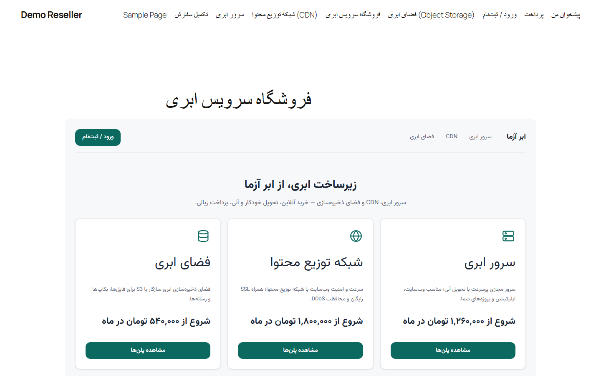 | 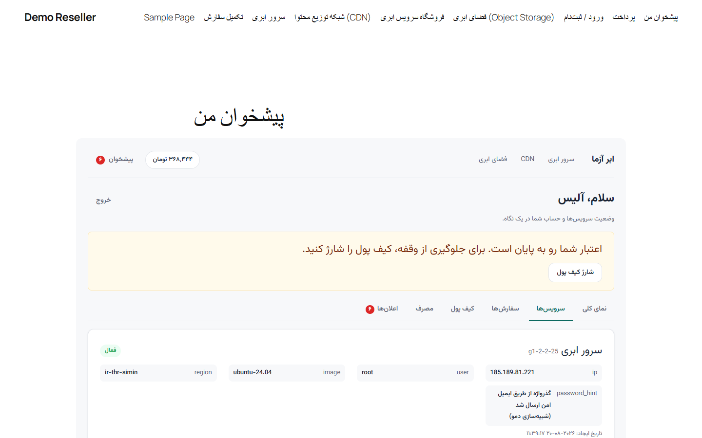 | 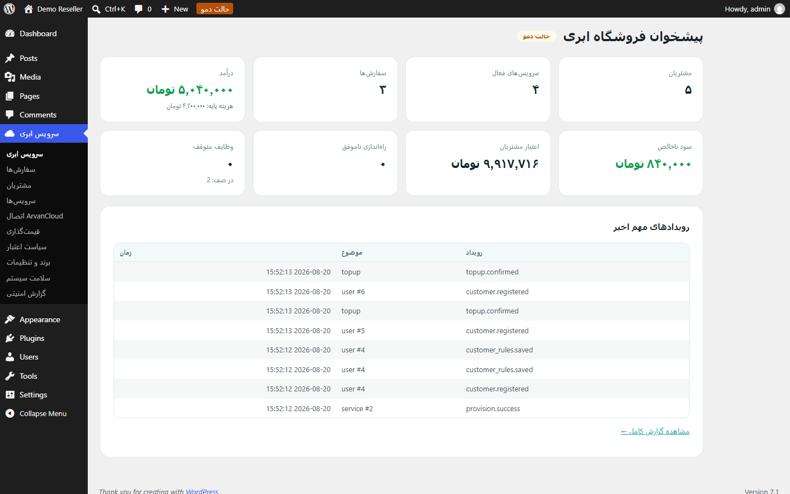 |

<details>
<summary>More screenshots (wizard, product config, wallet, mobile 390px…)</summary>

| | |
|---|---|
| 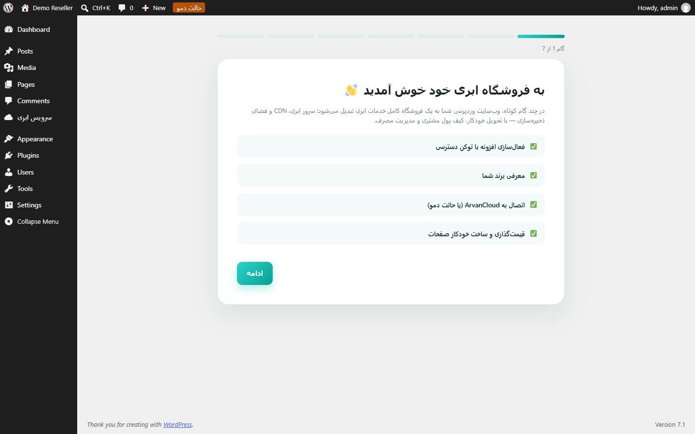 | 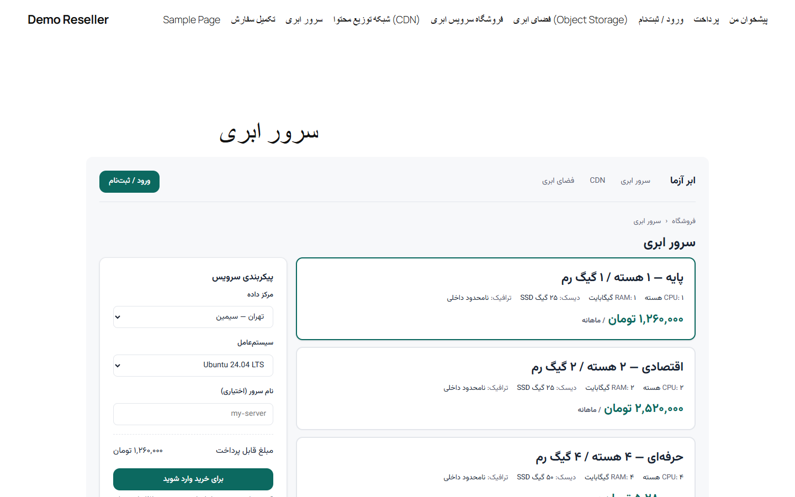 |
| 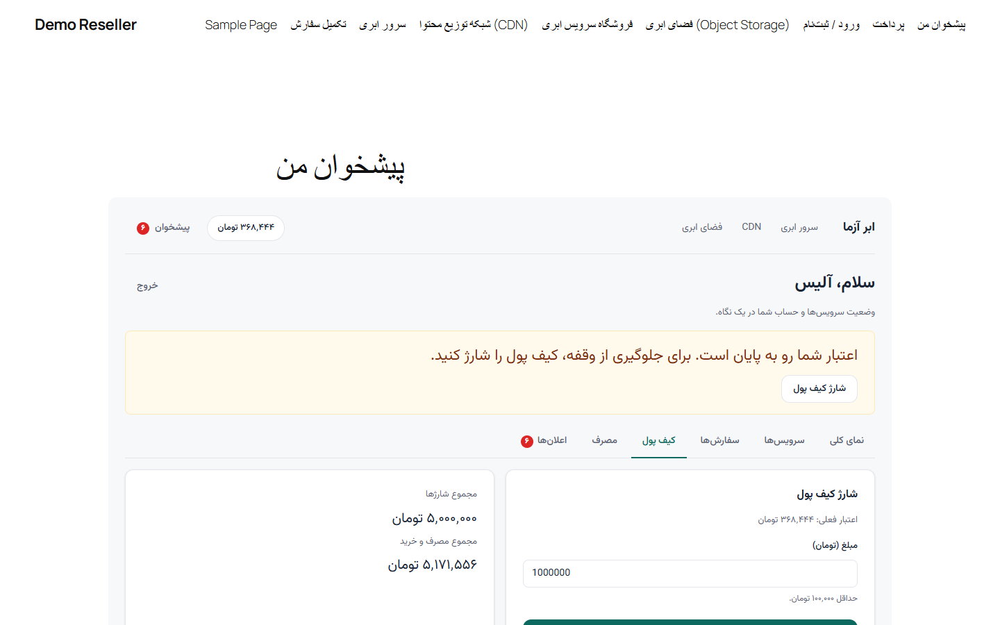 | 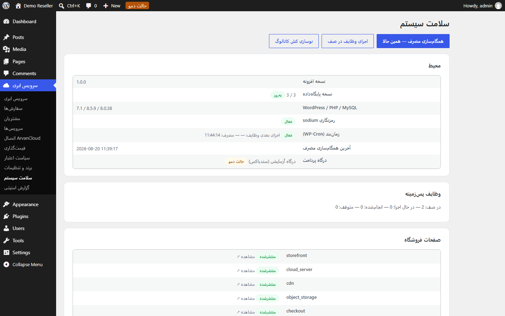 |
| 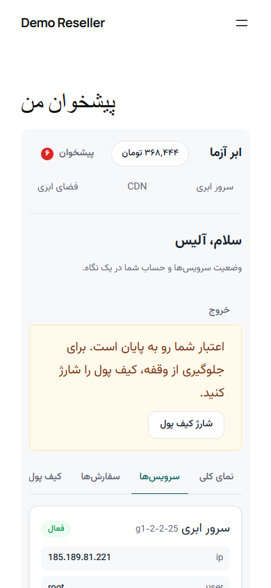 | 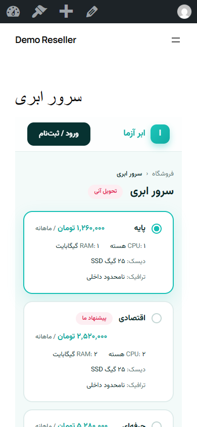 |

</details>

## Architecture

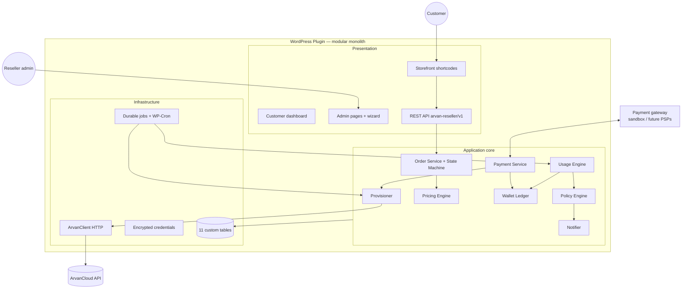

Deep-dives: [`ARCHITECTURE.md`](ARCHITECTURE.md) · [`docs/architecture/`](docs/architecture/) · [`docs/DATA_MODEL.md`](docs/DATA_MODEL.md)

## How a purchase works

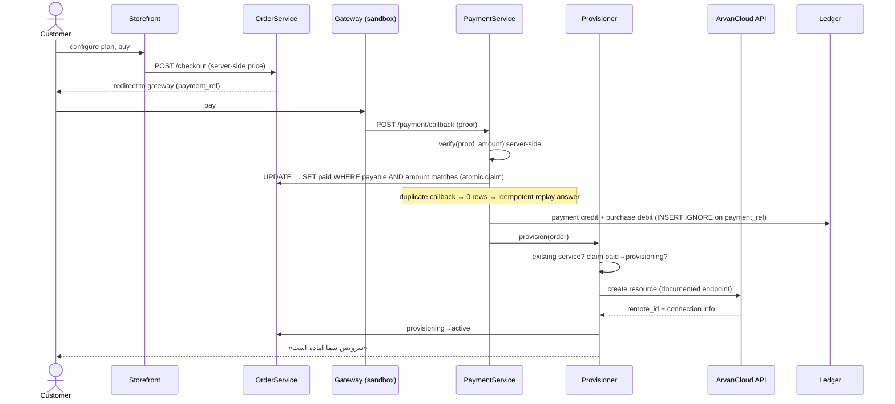

## Technical stack — and why

| Choice | Why (short) |
|---|---|
| **PHP 7.4+, namespaced, zero runtime Composer deps** | Installs on any standard host; Composer/PHPUnit are dev-only. |
| **Server-rendered PHP + vanilla JS/CSS** | ~9 KB JS total, RTL trivial, no build step, no React version drift inside wp-admin. Rejected React/Vue with evidence: [`docs/STACK_EVALUATION.md`](docs/STACK_EVALUATION.md) |
| **11 custom tables** | Financial rows (ledger, orders, usage) need indexes, uniqueness constraints and aggregate queries that `wp_options`/meta cannot provide. [ADR-0003](docs/adr/0003-database-strategy.md) |
| **Durable jobs table + WP-Cron runner** | WP-Cron is traffic-triggered, so durability lives in the table; production scaling = point real cron at `wp-cron.php`, zero code change. [ADR-0004](docs/adr/0004-background-jobs.md) |
| **Provider interfaces (Arvan, Payment)** | `DemoArvanProvider` ↔ `RealArvanProvider` swap without touching business logic; future PSP adapters implement one interface. [ADR-0005](docs/adr/0005-arvan-api-boundary.md), [ADR-0006](docs/adr/0006-payment-architecture.md) |
| **Append-only ledger** | Balance = Σ(entries); replay-safety via `UNIQUE(ref_type, ref_id, type)` + `INSERT IGNORE`. [ADR-0007](docs/adr/0007-wallet-ledger-model.md) |
| **libsodium secretbox for credentials** | Authenticated encryption keyed from WP salts via HMAC; Base64 or reversible obfuscation rejected. [ADR-0008](docs/adr/0008-secret-management.md) |
| **"ابرآروان" teal design system, Vazirmatn (SIL OFL)** | The whole UI implements a Claude Design artboard set (storefront, product, dashboard, auth, payment, wizard, admin) — glassy header, gradient hero/CTAs, radio-dot plan cards, pill tabs. The brand palette derives from one `--arvrs-brand` token so a reseller's brand color recolors everything. Vazirmatn is bundled (Sorkhab's Yekan Bakh is commercial). |

## Security

Security is a first-class deliverable (70/300 points). Highlights — full detail in [`SECURITY.md`](SECURITY.md) and [`docs/THREAT_MODEL.md`](docs/THREAT_MODEL.md):

- **Customer isolation**: every `/me/*` handler scopes by session user ID; IDs never come from the request (`Services::get_owned`).
- **Payment integrity**: prices recomputed server-side; callback proof is an HMAC over `(ref|amount|type)`; amount mismatch fails verification; atomic single-`UPDATE` claim kills replays and races.
- **Provisioning idempotency**: three layers — service-row check, state-machine claim, `UNIQUE(order_id)`.
- **Secrets**: sodium-encrypted at rest, masked (`••••last4`) in UI, never in REST responses, redacted from logs by key-pattern.
- **CSRF/XSS/SQLi**: nonces on every state change, escaping at sink, 100% `$wpdb->prepare()`.
- **Licensing**: bcrypt allowlist; only a SHA-256 fingerprint of the accepted token is stored.
- **Auditability**: credential changes, pricing changes, refunds, license events → append-only audit log with IP.

## Installation

**Requirements:** WordPress 6.2+, PHP 7.4+ with libsodium (standard), MySQL 5.7+/MariaDB 10.3+.

1. Download/build the plugin ZIP (see `DEVELOPMENT.md` → *Create plugin ZIP*), or copy this repo into `wp-content/plugins/arvan-reseller`.
2. Activate **Arvan Reseller Platform** in wp-admin → the onboarding wizard launches automatically.
3. Enter your Plugin Access Token (judges: demo token in `DEVELOPMENT.md`).
4. Follow the wizard: brand → Arvan API token (or skip for Demo Mode) → pricing → automatic page creation → done.

No WooCommerce, no page builder, no theme requirement, no Node.js at runtime.

## Development & testing

```bash
git clone https://github.com/ladekarl1234-commits/arvan-reseller.git
cd arvan-reseller
composer install          # dev tooling only
composer test             # 46 unit tests
```

Full environment (wp-env / wp-cli + SQLite), seed data and E2E scenario: [`DEVELOPMENT.md`](DEVELOPMENT.md) · [`TESTING.md`](TESTING.md)

## Project structure

```
arvan-reseller.php     Bootstrap: autoloader, activation hooks
src/
  Plugin.php           Composition root (hooks → modules)
  Install/             Schema migrations, page factory, activator
  Licensing/           Plugin Access Token verification
  Arvan/               Provider boundary: client, real/demo providers, credentials, catalog
  Pricing/             Pure engine + settings facade + base costs
  Orders/              State machine + order service
  Payments/            Provider interface, sandbox gateway, callback service
  Provisioning/        Idempotent provisioner
  Wallet/              Append-only ledger
  Usage/               Usage sync + policy application
  Policies/            Pure staging engine
  Jobs/                Durable job runner
  Notifications/       Cooldown-aware notifier
  Admin/  Front/  Rest/  Onboarding/  Identity/  Audit/  Support/
templates/             Server-rendered admin + front views (escape at sink)
assets/                Plugin-scoped CSS/JS + bundled Vazirmatn (OFL)
tests/                 PHPUnit unit suite + WP shims
docs/                  Engineering handbook (ADRs, threat model, scalability…)
```

## Documentation

[spec.md](spec.md) — engineering source of truth · [ARCHITECTURE.md](ARCHITECTURE.md) · [SECURITY.md](SECURITY.md) · [docs/STACK_EVALUATION.md](docs/STACK_EVALUATION.md) · [docs/SCALABILITY.md](docs/SCALABILITY.md) · [docs/CAPACITY_MODEL.md](docs/CAPACITY_MODEL.md) · [docs/API_INTEGRATION.md](docs/API_INTEGRATION.md) · [docs/DATA_MODEL.md](docs/DATA_MODEL.md) · [docs/THREAT_MODEL.md](docs/THREAT_MODEL.md) · [docs/adr/](docs/adr/) · [docs/REQUIREMENTS_TRACEABILITY.md](docs/REQUIREMENTS_TRACEABILITY.md) · [CONTRIBUTING.md](CONTRIBUTING.md) · [HACKATHON_READINESS.md](HACKATHON_READINESS.md)

## Known limitations

Honest list — each with the fallback that ships:

- **No public Arvan billing/usage API** (verified) → real-mode usage rows are not fetchable; the reseller bills fixed monthly packages, and the full usage engine is demonstrated with the deterministic demo provider. Single integration point ready when Arvan publishes one.
- **No public pricing API** → base costs are an admin-maintained table seeded from the public pricing page, with source + timestamp stamps.
- **Object Storage access keys** are panel-issued upstream; the plugin provisions the bucket and tells the customer where keys come from.
- **Static offline PAT allowlist** is hackathon-appropriate licensing, not commercial DRM ([ADR-0009](docs/adr/0009-licensing-model.md) documents the signed-license upgrade path).
- **WP-Cron** depends on site traffic; production installs should point real cron at `wp-cron.php` (documented in SCALABILITY).

## Roadmap

See [`ROADMAP.md`](ROADMAP.md) — real PSP adapters (Zarinpal/IDPay), Arvan usage API integration when published, reservation-based checkout from wallet balance, per-credential load distribution, notification digests.

## Contributing

See [`CONTRIBUTING.md`](CONTRIBUTING.md). Short version: read `spec.md`, follow the module boundaries in `ARCHITECTURE.md`, every PR needs tests + the security checklist, ledger changes need an ADR.

## License

GPL-2.0-or-later. Bundled Vazirmatn font: SIL OFL 1.1 (`assets/fonts/OFL.txt`).
