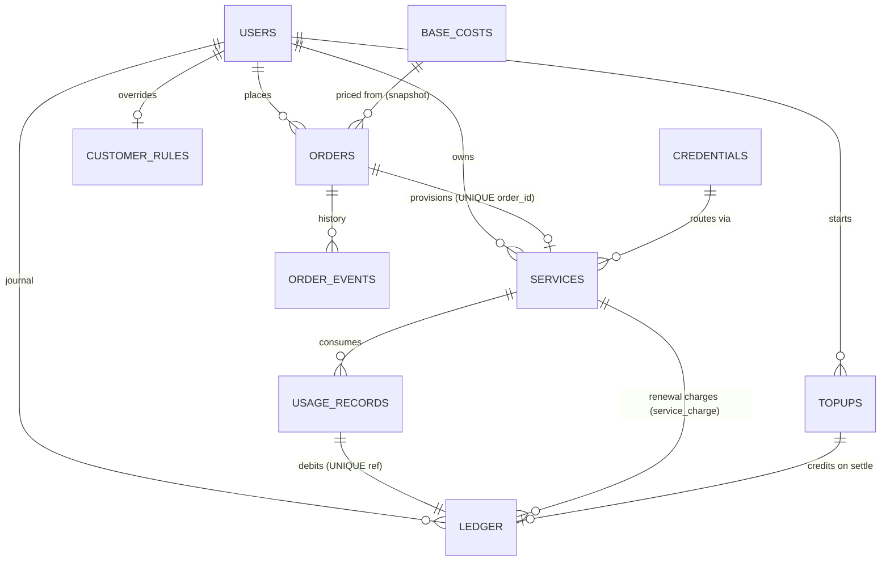

# Data Model

12 custom tables (`{prefix}arvrs_*`), schema-versioned (`arvrs_schema_version`, migrations in `src/Install/Schema.php`, idempotent dbDelta, currently version 5). Amounts are integer **toman (IRT)** — no floats near money. All timestamps UTC (`created_at`/`updated_at` datetime).

## Tables

### `credentials`
Arvan API credential entries. `token_enc` (sodium ciphertext), `token_last4`, `enabled`, `products` (csv routing filter), `priority`, `is_default`, `last_ok_at`/`last_error` (health). *Key:* `enabled`.

### `orders`
One row per purchase intent. `status` (state machine), `pricing` (immutable JSON snapshot), `amount`/`base_cost`/`margin` (denormalized for indexed revenue aggregates), `payment_ref` **UNIQUE** (claim key), `config` (whitelisted JSON), `is_demo`. *Keys:* `customer_id`, `status`, `created_at`.

### `order_events`
Append-only transition log `(order_id, from_status, to_status, actor, note)`. *Key:* `order_id`.

### `services`
Permanent mapping `(order_id UNIQUE, customer_id, credential_id, product, plan_id, remote_id, status, connection JSON, is_demo)` plus the renewal clock — `renews_at`, `term_days` (default 30), `renewal_price`, `renewal_count` — that `Billing\Renewals` charges against. The isolation + usage-attribution + billing anchor. *Keys:* `customer_id`, `status`, `(status, renews_at)` (the renewal-due scan), `remote_id`.

### `ledger`
Append-only journal: `type` (topup/payment/purchase/usage_debit/service_charge/adjustment/refund/promo_credit/reservation/release), `direction`, `amount`, `ref_type`+`ref_id`, `actor`. **UNIQUE `(ref_type, ref_id, type)`** — the replay-safety backbone (INSERT IGNORE + `rows_affected`). `service_charge` is the type `Billing\Renewals` writes on each term renewal, keyed `('renewal', "{service_id}:{period_start}")`. *Keys:* `customer_id`, `created_at`. Never updated, never deleted. `balance()`/`balances()` read this table through a single indexed `GROUP BY` aggregate, not a per-row PHP sum.

### `usage_records`
`(service_id, customer_id, period_start, period_end, quantity, unit, cost, price)`. **UNIQUE `(service_id, period_start, period_end)`** — a closed period ingests exactly once. `cost` and `price` are split so both metered usage and renewal term-charges can report margin (`Reports\Reports`); pre-split rows were backfilled `price = cost` in the v4→v5 migration. *Key:* `customer_id`.

### `topups`
`(ref UNIQUE, customer_id, amount, status, created_at, expires_at)`. A pending top-up intent: created when a customer starts a wallet top-up, settled or expired by the payment callback / an expiry sweep. Replaces a pre-1.1 design that stored one autoloaded-off `wp_options` row per intent with no expiry and no sweep — the v4→v5 migration moved any still-pending option rows into this table. *Key:* `(status, expires_at)` (the expiry sweep).

### `jobs`
Durable queue: `type`, `payload` JSON, `status` (pending/running/done/dead), `attempts`/`max_attempts`, `run_at`, `last_error`. *Key:* `(status, run_at)` — the claim scan.

### `audit_log`
`(user_id, action, object_type, object_id, detail JSON-redacted, ip, level)`; `level` separates security audit rows from diagnostics. *Keys:* `created_at`, `action`.

### `notifications`
In-app inbox, `customer_id = 0` addresses the admin. *Keys:* `(customer_id, is_read)`, `(type, created_at)` — the cooldown lookup.

### `customer_rules`
One row per customer (PK `customer_id`); every column nullable = inherit default: markup/discount/fixed adjustment, credit & spending limits, allowed products, status (active/blocked), grace days.

### `base_costs`
`(product, plan_id)` **UNIQUE** → monthly base cost + `source` + `updated_at`. The PricingProvider substrate (no upstream pricing API exists).

## Storage placement rules

- `wp_options`: one whitelisted settings array (`arvrs_settings`), license state, schema version, demo registry. Top-up intents live in the `topups` table (above), not in `wp_options`.
- `usermeta`: only the derived `arvrs_policy_stage`.
- Everything transactional: the tables above (ADR-0003).

## Integrity mechanisms (summary)

| Race | Mechanism |
|---|---|
| Double payment | UNIQUE `payment_ref` + single-UPDATE claim with amount match |
| Double credit/debit | UNIQUE ledger ref + INSERT IGNORE + `rows_affected` check |
| Double provision | UNIQUE `services.order_id` + state-machine claim |
| Double usage charge | UNIQUE usage period + 1:1 ledger ref to the usage row |
| Concurrent job runners | single-row optimistic claim on `status='pending'` |
| Concurrent admin state changes | `UPDATE … WHERE status = current` (losers get false) |
