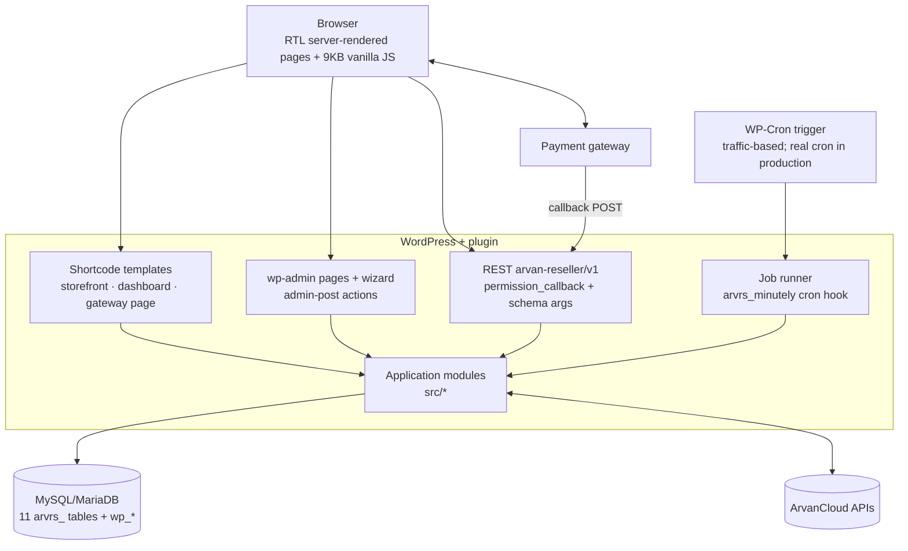

# Container / Runtime View

Everything runs inside one WordPress deployment; "containers" here are runtime responsibilities, not Docker images.

Runtime facts worth knowing:
- Assets enqueue only on plugin pages (checked via `has_shortcode` / hook suffix).
- No external HTTP occurs during ordinary page render (catalog cached 6 h).
- The job runner executes inside a WP-Cron request at Stage A; Stage B/C move the trigger, never the code (ADR-0004, SCALABILITY).
