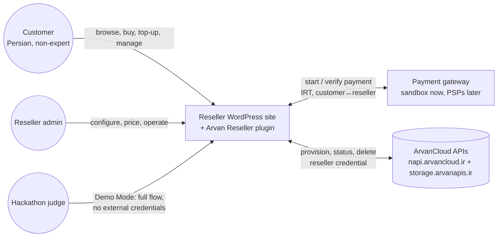

# System Context

Who talks to what, and which money/data crosses each line.

Boundary notes:
- Money flows **customer ↔ reseller site** only; reseller ↔ Arvan settlement is out of scope (no API exists — spec §14).
- The customer never needs the ArvanCloud panel for the purchase lifecycle; the only upstream-panel touchpoint is Object-Storage S3 key issuance (documented API gap).
- In Demo Mode both external arrows are simulated at the boundary; every internal arrow is real (ADR-0010).
