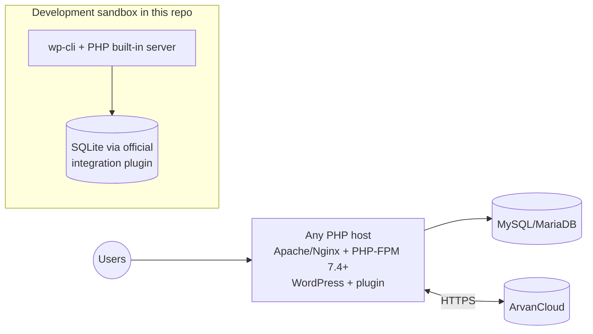
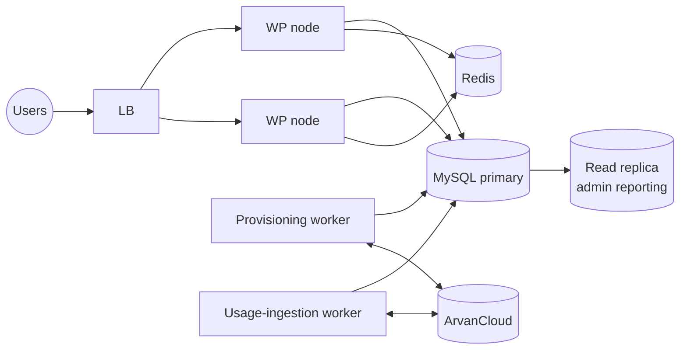

# Deployment View

## Now (hackathon / Stage A)

One artifact (plugin ZIP), one host, zero extra services. The dev sandbox (DEVELOPMENT.md) proves the plugin also runs on the SQLite integration — useful for CI and judges without MySQL.

## Production hardening (Stage B — configuration only)

- `DISABLE_WP_CRON` + real cron `*/1` hitting `wp cron event run --due-now`
- Redis object-cache drop-in (accelerates catalog cache + rate limiting cluster-wide)
- HTTPS everywhere; standard WP hardening applies

## Future scalable shape (Stage C — extraction, same tables)

Workers consume the same `arvrs_jobs` / `arvrs_usage_records` tables the plugin writes today — extraction adds processes, not schema (ADR-0011; triggers in SCALABILITY).
