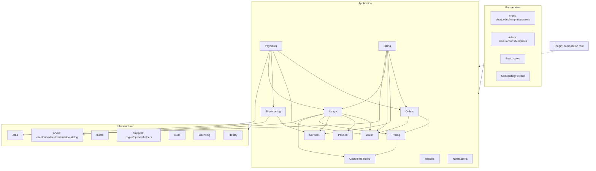

# Module View

See [`ARCHITECTURE.md`](../../ARCHITECTURE.md) for the ownership table and dependency rules — this page adds the picture and the reasoning shorthand.

`Billing` (`Billing\Renewals`, recurring/term charges) and `Reports` (`Reports\Reports`, period revenue/cost/margin/MRR/churn) were added after this diagram was first drawn — see `ARCHITECTURE.md` for the current ownership table, which is the one kept in sync with the source on every doc pass; this picture is illustrative and can lag it.

Reading order for a new engineer: `Plugin.php` (wiring) → `Orders\StateMachine` (the invariants) → `Payments\PaymentService` (the critical pipeline) → `Provisioning\Provisioner` → `Wallet\Ledger` → one template. That path covers 80% of the system's ideas in ~600 lines.
