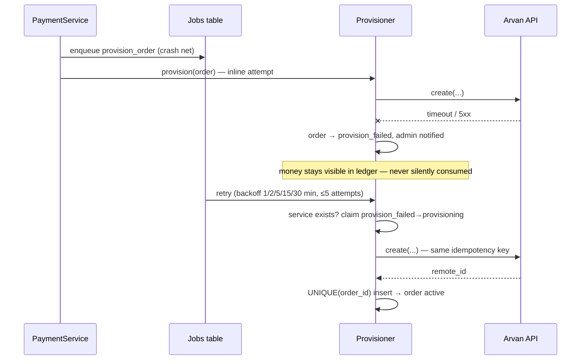

# Key Sequences

The purchase sequence lives in [`README.md`](../../README.md#how-a-purchase-works). Below: usage accounting and the failure path.

## Usage → ledger → policy

```mermaid
sequenceDiagram
    participant CR as Cron / Sync-now
    participant U as UsageSync
    participant P as Provider (demo/real)
    participant DB as usage_records
    participant L as Ledger
    participant PE as PolicyEngine
    participant N as Notifier

    CR->>U: sync_all()
    U->>P: usage(product, remote_ids, since)
    P-->>U: closed periods only (deterministic in demo)
    loop each row
        U->>DB: INSERT IGNORE (service, period)  — rows_affected=0 ⇒ skip
        U->>L: usage_debit ref=usage_id (UNIQUE ⇒ once)
    end
    U->>L: balance(customer) — derived, never stored
    U->>PE: stage(available, thresholds, grace)
    PE-->>U: healthy…restricted + enabled actions
    U->>N: notify (cooldown-checked)
    Note over U,N: block_purchases enforced later at checkout;<br/>suspend only via documented API + admin intent
```

## Provisioning failure → retry


